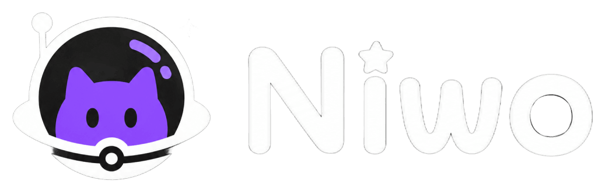
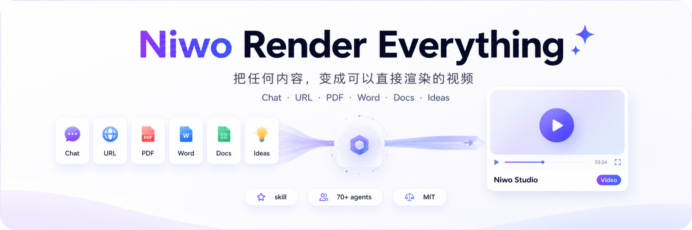
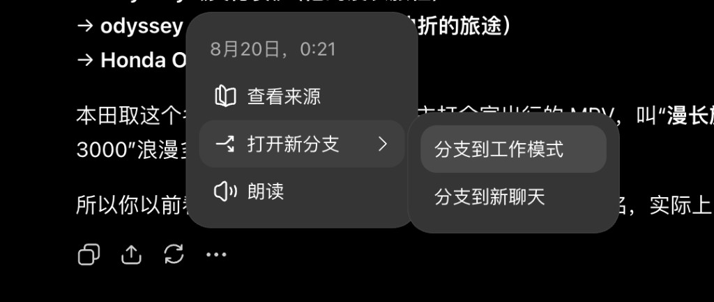
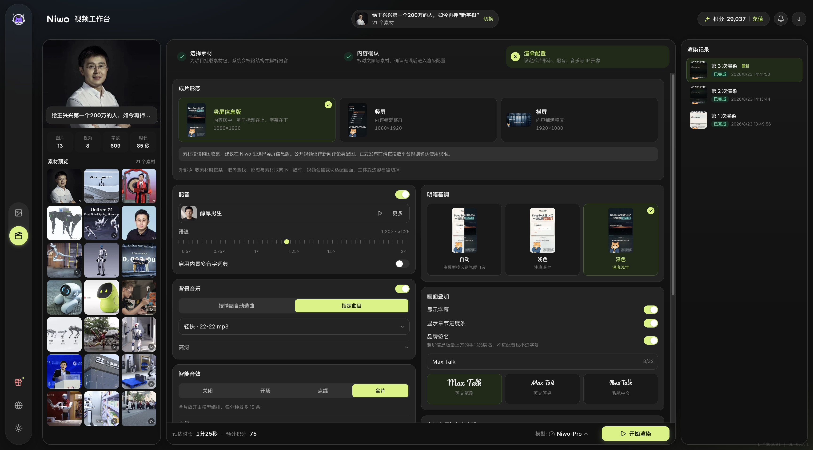
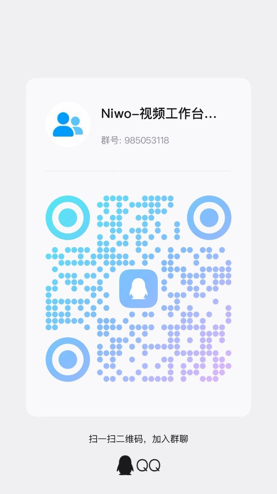

<p align="center">
  
</p>

<h1 align="center">Render Everything</h1>

<p align="center">
  <strong>把任意内容做成短视频。</strong>
</p>

<p align="center">
  <a href="https://github.com/MontageAI/niwo-render-everything/blob/main/skills/niwo-render-everything"></a>
  <a href="#环境要求"></a>
  <a href="#license"></a>
  <a href="https://github.com/AudareLesdent"></a>
</p>

<p align="center">
  
</p>

PDF、论文、网页链接、Word，或你和 AI 正在聊的话题——只要能丢进 Cursor、ChatGPT、Claude 这类 Agent，这个 Skill 就能帮你整理成一条短视频。

它先做出一份素材包（口播文案、真实画面、镜头选段），你再把 zip 上传到 [Niwo 视频工作台](https://niwo.studio/video-studio)。素材包是 Niwo 渲染体系的输入，成片在产品里出。

## 它做什么

| 定稿口播 | 找真实素材 | 裁好镜头 | 上传成片 |
| --- | --- | --- | --- |
| 按成片形态写文案，竖屏信息版连钩子标题一起定 | 下载图片和 B-roll，不是只给链接 | 用 ffmpeg 定好每一段用哪几秒 | 把 zip 上传到 [视频工作台](https://niwo.studio/video-studio) 渲染 |

<p align="center">
  
</p>

## 成片示例

这些片子由 Skill 出包后，在 [Niwo 视频工作台](https://niwo.studio/video-studio) 渲染。目前做了三种形态：竖屏信息版、竖屏、横屏；后面会不断加入更多视频类型。如果你有好的想法或 demo，也欢迎来[交流群](#qq-交流群)联系我们。点播放才会加载视频。

### 竖屏信息版

<p align="center">
  <video src="https://github.com/user-attachments/assets/509a21fa-b0b8-4aa2-a534-ef7cba059e77" controls preload="metadata" playsinline width="260"></video>
  <video src="https://github.com/user-attachments/assets/08caf3a7-9d6a-43dd-9e0e-7a121dc6e5c9" controls preload="metadata" playsinline width="260"></video>
</p>

<p align="center">恒大 / 许家印　·　宇树 IPO</p>

### 竖屏

<p align="center">
  <video src="https://github.com/user-attachments/assets/e2d43357-f4ff-4a70-918e-7ea2bfe65b28" controls preload="metadata" playsinline width="240"></video>
  <video src="https://github.com/user-attachments/assets/2e469b87-5bd9-45b6-9b28-2decbc1d3616" controls preload="metadata" playsinline width="240"></video>
  <video src="https://github.com/user-attachments/assets/ce209ddd-5fe4-4208-b840-8dabfa9226f7" controls preload="metadata" playsinline width="240"></video>
</p>

<p align="center">DeepSeek API 涨价　·　抖音为什么赢　·　炼金术士</p>

### 横屏

<p align="center">
  <video src="https://github.com/user-attachments/assets/1ec035ae-23b1-444e-a983-c1a505538f68" controls preload="metadata" playsinline width="720"></video>
</p>

<p align="center">DeepSeek × 宇树</p>

这些成片里带了 IP 形象。你可以在 [Niwo 视频工作台](https://niwo.studio/video-studio) 轻松定制自己的虚拟 IP，并用它来出镜。也可以选择不加任何 IP 形象，全看你自己。

## 在哪用

这个 Skill 要跑在**能下文件、能执行命令的 Agent 工作模式**里。普通闲聊对话框通常下不了图、跑不了 ffmpeg，装了也做不完。

**首选 ChatGPT 工作模式。** Codex 我们也实测过，可用。WorkBuddy 是配套 Agent，豆包工作模式、Cursor、Claude Code 这类能跑 Skill、带终端的 Agent 同样能装。

| 产品 | 推荐 | 实测 | 怎么用 |
| --- | --- | --- | --- |
| [ChatGPT 工作模式](https://chatgpt.com/) | 首选 | 已实测，可用 | 进入**工作模式**，先让它安装 Skill，再把内容丢进去做短视频。如果已经在普通聊天里聊过，点消息下方 **… → 打开新分支 → 分支到工作模式** |
| [Codex](https://openai.com/codex/) | 推荐 | 已实测，可用 | 在 Codex 里直接发安装口令，装好后说要做短视频，或用 `$niwo-render-everything` 点名调用 |
| [WorkBuddy](https://www.workbuddy.cn/) | 推荐 | 未实测 | 在能执行任务的**工作模式**里发安装口令（不要用只聊天的普通对话），装好后把 PDF、链接或话题丢进去 |
| [豆包](https://www.doubao.com/) 工作模式 | 可用 | 未实测 | 在豆包的**工作模式**里发安装口令；入口以豆包当前 Skill / 插件设置为准 |
| [Cursor](https://cursor.com/) | 可用 | 未实测 | 在 Agent 对话里发安装口令，装好后把内容丢进去 |
| [Claude Code](https://claude.com/claude-code) | 可用 | 未实测 | 在终端对话里发安装口令，装好后直接说要做片 |
| 普通聊天 / 手机助手 | 不适合 | — | 一般不能把图片和视频下载到本地，缺一项就跑不完 |

`npx skills add` 还能装到 OpenCode 等更多 Agent。只要对方能联网下载文件、能跑 `ffmpeg`、能打包 zip，就可以用。

## 怎么安装

不要先去本机敲命令。打开你常用的 Agent，切到**工作模式**（ChatGPT 工作模式、Codex、WorkBuddy 能执行任务的模式），把下面这句话发给它：

```
帮我安装这个 Skill：https://github.com/MontageAI/niwo-render-everything
```

Agent 会自己把插件装上。装完再把 PDF、链接或话题丢给它，让它做短视频。

**必须在工作模式里发，不要在普通对话里发。** 普通聊天装不了、也跑不完这个 Skill。ChatGPT 如果已经在普通聊天里聊过，用 **… → 打开新分支 → 分支到工作模式**。

<details>
<summary>也可以自己在终端装（给习惯命令行的人）</summary>

本机需要 Node.js。在终端执行：

```bash
npx skills add MontageAI/niwo-render-everything
```

装到用户目录、所有项目都能用：

```bash
npx skills add MontageAI/niwo-render-everything -g
```

只装到某几个产品：

```bash
npx skills add MontageAI/niwo-render-everything -g -a codex -a cursor
```

国内访问 GitHub 如果超时，先开代理或 VPN 再执行。

</details>

## 环境要求

这个 Skill 需要 Agent 具备三项能力，缺一项就跑不完：

1. 能联网访问网页并**下载图片、视频文件到本地**，不是只给链接
2. 能执行 shell 命令，环境里有 `ffmpeg` 和 `ffprobe`
3. 能把本地目录打包成 zip 交付给你

所以请在 ChatGPT **工作模式**、Codex、WorkBuddy、Cursor、Claude Code、豆包工作模式这类环境里用。

macOS 装 ffmpeg：

```bash
brew install ffmpeg
```

## 怎么用

装好之后，在上面推荐的产品里把内容丢给 Agent，直接说你想做什么，比如：

> 帮我把这篇论文做成 90 秒科普短视频
>
> 把这个新闻链接做成一条竖屏
>
> 帮我把 DeepSeek 涨价这件事做成一条一分钟的竖屏短视频

Agent 会先读你给的材料，再问成片方向（竖屏、横屏还是方形）、目标时长、讲给谁看，然后给你一版文案草稿。文案定稿后它才开始找素材，最后交给你一个 zip。

### 已经在 ChatGPT 普通聊天里聊过？

不要在原聊天里继续硬做。点那条消息下面的 **…**，选 **打开新分支**，再选 **分支到工作模式**。上下文会一起带过去，Skill 才能下文件、跑 ffmpeg。

<p align="center">
  
</p>

## 产出物

```
content.json     # 文案、画幅、钩子标题、多音字注音
manifest.json    # 每个素材的画面说明、标签、来源、选段
images/
videos/
```

`content.json` 只包含**内容**。成片形态、配音、背景音乐、智能音效这些，上传之后在视频工作台里再选。

## 上传到 Niwo 视频工作台

zip 不是成片。Agent 交包之后，先把压缩包**下载到本地**，再打开 [Niwo 视频工作台](https://niwo.studio/video-studio) 上传。上传后走三步：选素材、确认内容、渲染配置。到渲染配置页选你要的成片形态（竖屏信息版 / 竖屏 / 横屏），以及配音、背景音乐、智能音效、明暗基调、字幕等，选好点「开始渲染」即可。

工作台提供多种成片形态和渲染模型，高质量、高效率都能覆盖，按这条片子的要求选就行。

<p align="center">
  
</p>

当前还在**内测**。想开新账号或领取免费试用额度，请先加入下面的 QQ 交流群，在群里联系维护者。

## 自校验

打包前 Agent 会跑一遍 `scripts/validate_bundle.py`，它检查字段合法性、manifest 与实际文件的对应关系、视频选段是否落在真实时长内，还能识破下载时拿到 HTML 错误页的情况。你也可以手动跑：

```bash
python3 skills/niwo-render-everything/scripts/validate_bundle.py <素材包目录>
```

## 交流与维护

这个 Skill 由 [AudareLesdent](https://github.com/AudareLesdent) 维护。用着有问题、想聊成片方向，或素材包校验没过，都可以来找我。

<p align="center">
  <a href="https://github.com/AudareLesdent">
    
  </a>
</p>

<p align="center">
  <b><a href="https://github.com/AudareLesdent">@AudareLesdent</a></b><br>
  GitHub · 欢迎 Watch / Star / 提 Issue
</p>

### QQ 交流群

群名 **Niwo-视频工作台**，群号 **985053118**。用 QQ 扫下面的码，或在客户端里搜群号加入。

<p align="center">
  
</p>

公开仓库这边也可以直接提 [Issue](https://github.com/MontageAI/niwo-render-everything/issues)。

## 关于这个仓库

这是自动同步的镜像仓库，内容来自 Niwo 的主仓库，**不接受 Pull Request**（提交会在下次同步时被覆盖）。有问题或建议请提 [Issue](https://github.com/MontageAI/niwo-render-everything/issues)，或进上面的交流群。

## License

MIT
